<p align="center">
  
</p>

<h1 align="center">Access Context Fuzzer</h1>

<p align="center">
  <strong>A comprehensive Burp Suite extension for testing access control, path traversal, and Web Cache Deception vulnerabilities — all in one tool.</strong>
</p>

<p align="center">
  <em>Developed with 🛡️ by <a href="https://tagmachan.com">Tagoletta</a></em>
</p>

<p align="center">
  <a href="#installation">Installation</a> •
  <a href="#features">Features</a> •
  <a href="#usage">Usage</a> •
  <a href="#web-cache-deception">Web Cache Deception</a> •
  <a href="#building-from-source">Build</a> •
  <a href="#contributing">Contributing</a>
</p>

<p align="center">
  
  
  
  
  <a href="https://github.com/Tagoletta/AccessContextFuzzer/releases/latest"></a>
</p>

---

<a id="installation"></a>

## 📥 Installation

### Option 1: Download Pre-built JAR (Recommended)

1. Go to **[Releases](https://github.com/Tagoletta/AccessContextFuzzer/releases/latest)**
2. Download `access-context-fuzzer-2.0.0-jar-with-dependencies.jar`
3. Open **Burp Suite** → **Extensions** → **Add**
4. Select the downloaded JAR file
5. The **"Access Context"** tab will appear in Burp Suite

<p align="center">
  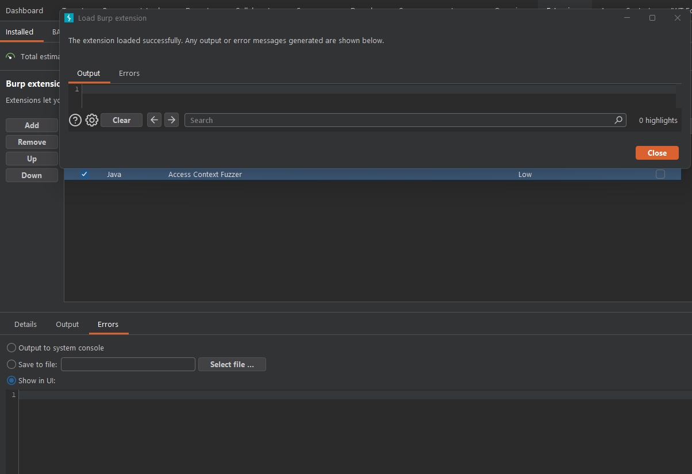
</p>

### Option 2: Build from Source

See [Building from Source](#-building-from-source) below.

---

## 🎯 What is Access Context Fuzzer?

**Access Context Fuzzer** is a Burp Suite extension designed for security researchers and penetration testers who need to systematically test for **access control bypass** and **Web Cache Deception (WCD)** vulnerabilities.

Instead of manually crafting dozens of header and path variations, this extension **automatically generates and tests hundreds of bypass variants** in seconds — then highlights exactly which ones behave differently from the baseline.

<p align="center">
  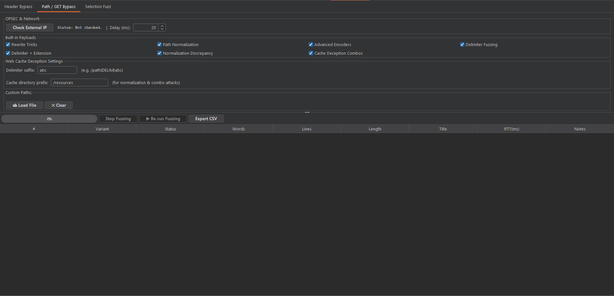
</p>

---

## 🌟 What's New in v2.0 (The "Smart Fuzz" Update)

Access Context Fuzzer has been significantly upgraded to tackle modern web applications, aggressive WAFs, and complex API gateways:

- 🧠 **MD5 Body Hash Engine & "Interesting" Filter:** Detects hidden state changes (`BODY_DIFF`) even when the status code remains the same. Click **"🔍 Show Only Interesting"** to instantly filter out noise.
- 🛡️ **Adaptive Rate Limiting Anti-WAF:** Automatically doubles the delay upon `429 Too Many Requests` or `503`, and halts the scan if the WAF starts dropping connections (`status -1`).
- ⏱️ **Real-Time Fuzz Estimation:** The progress bar now dynamically estimates `(~1:45 remaining)` based on rolling RTT averages.
- 🔄 **Session Drift Detection:** Re-verifies your baseline every 50 requests. If your session expires (`SESSION_DRIFT`), it pauses the scan and warns you.
- 🗂️ **Bulk "Send to Repeater":** Multi-select support! Send all "Interesting" variants to the Repeater with a single click.
- 🎯 **Scan Profiles:** 1-click preset buttons (`⚡ Quick Scan`, `🔥 Full Scan`, `🎯 WCD Only`) instantly configure the payloads.
- 🧬 **Deep Protocol Injection:** Added WebDAV verbs, case-tampering (`gEt`), HTTP/2 pseudo-header injection (`:authority`), and obscure unicode traversals.

---

### Why This Tool?

| Problem | Without This Tool | With Access Context Fuzzer |
|---------|-------------------|---------------------------|
| Header bypass testing | Manually add `X-Forwarded-For`, `X-Real-IP`, etc. one by one | **40+ header variants** tested simultaneously |
| Path normalization bugs | Guess which encoding tricks work | **Systematic fuzzing** of URL encoding, double encoding, IIS Unicode, dot-segments |
| Web Cache Deception | Complex multi-step manual testing | **Automated 4-phase WCD pipeline** with cache header detection |
| Result analysis | Compare responses manually | **Smart color-coded diff** — status changes, word deltas, length anomalies highlighted automatically |

---

<a id="features"></a>

## ✨ Features

### 🔹 Three Fuzzing Engines

Access Context Fuzzer provides three independent fuzzing engines, each accessible via its own tab:

<p align="center">
  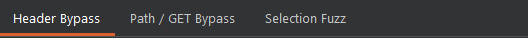
</p>

---

### 1️⃣ Header Bypass

Tests access control enforcement by injecting **IP spoofing and host manipulation headers**.

<p align="center">
  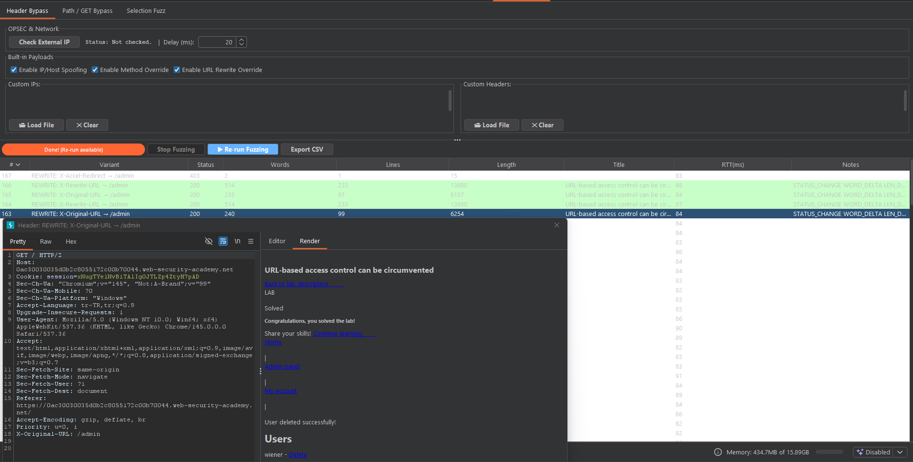
</p>

**What it tests:**

| Category | Headers | Example |
|----------|---------|---------|
| **IP Spoofing** | `X-Forwarded-For`, `X-Real-IP`, `X-Client-IP`, `True-Client-IP`, `CF-Connecting-IP`, and 30+ more | `X-Forwarded-For: 127.0.0.1` |
| **Host Override** | `X-Forwarded-Host`, `X-Host`, `X-Original-Host` | `X-Host: allowed-origin.com` |
| **Custom IPs** | User-defined list | Any IP you specify |
| **Custom Headers** | User-defined `Header: Value` pairs | Load from wordlist file |

**Use case:** Testing if the application relies on easily spoofable headers for access control decisions (e.g., admin panels restricted by IP).

---

### 2️⃣ Path / GET Bypass

Tests path-level access control by manipulating the **URL path** using various encoding and normalization techniques.

<p align="center">
  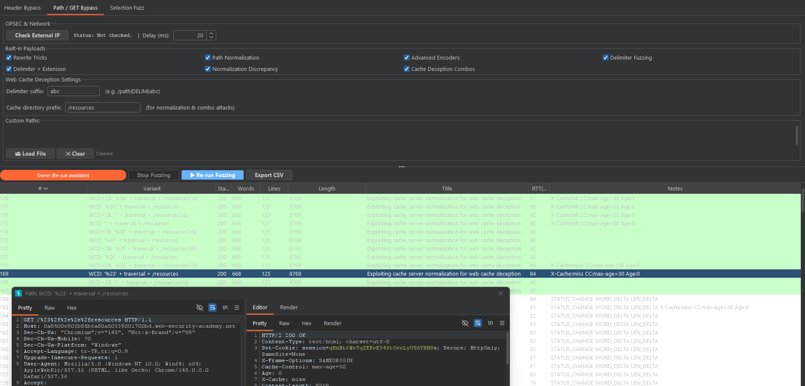
</p>

**What it tests:**

| Technique | Checkbox | Example | Purpose |
|-----------|----------|---------|--------|
| **URL Encoding** | `Path Normalization` | `/%61%64%6d%69%6e` | Bypass path-matching rules |
| **Double URL Encoding** | `Path Normalization` | `/%2561%2564%256d%2569%256e` | Exploit double-decode vulnerabilities |
| **IIS Unicode Encoding** | `Path Normalization` | IIS short/wide Unicode variants | Target IIS-specific normalization |
| **Case Flipping** | `Advanced Encoders` | `/Admin`, `/ADMIN` | Case-sensitive path matching |
| **Trailing Slash** | `Advanced Encoders` | `/admin/` | Path normalization differences |
| **Dot-Segment Injection** | `Advanced Encoders` | `/path/..;/admin` | Tomcat/Spring path traversal |
| **Double Slash Prefix** | `Advanced Encoders` | `//admin` | Proxy path confusion |
| **JSON Suffix** | `Advanced Encoders` | `/admin.json` | Content negotiation bypass |
| **Semicolon Suffix** | `Advanced Encoders` | `/admin;` | Parameter delimiter abuse |
| **X-Rewrite-URL** | `Rewrite Tricks` | Header: `/admin` | Frontend/backend path discrepancy |
| **X-Original-URL** | `Rewrite Tricks` | Header: `/admin` | URL override |
| **X-Accel-Redirect** | `Rewrite Tricks` | Header: `/admin` | **Nginx / OpenResty** internal redirect bypass |
| **Custom Paths** | — | User-defined paths | Load from wordlist file |

---

### 3️⃣ Selection Fuzz

Allows you to **select specific text** within a request and fuzz just that portion with various encodings.

<p align="center">
  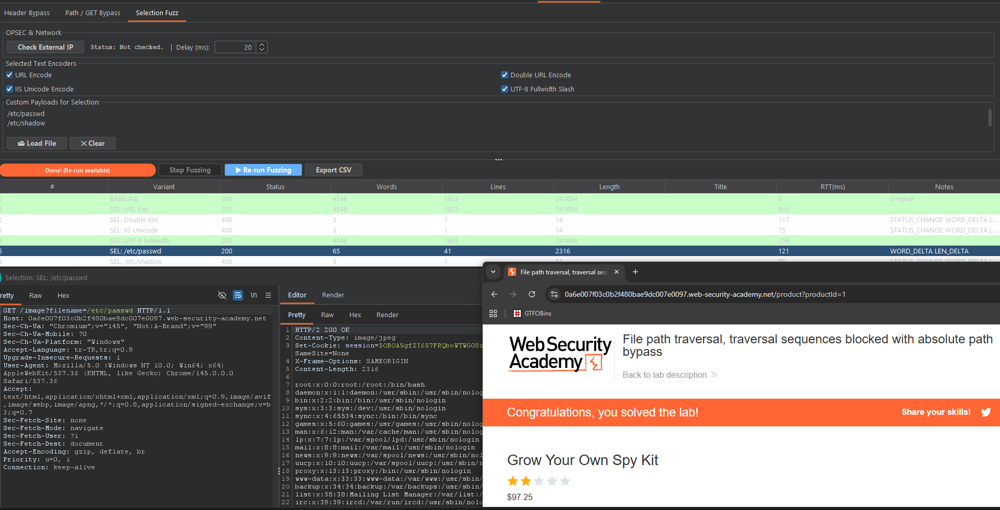
</p>

**What it tests:**

| Encoder | Description |
|---------|-------------|
| **URL Encode** | Standard percent-encoding of selected text |
| **Double URL Encode** | Double-layer encoding |
| **IIS Unicode Encode** | IIS-specific Unicode mapping |
| **UTF-8 Fullwidth Slash** | Fullwidth character substitution |
| **Custom Payloads** | User-defined replacements from file or manual input |

**Use case:** When you've identified a specific parameter or path segment that might be vulnerable, select it and test encoding-specific bypasses.

---

<a id="web-cache-deception"></a>

### 🔹 Web Cache Deception (WCD) Testing

A dedicated 4-phase pipeline for discovering and exploiting Web Cache Deception vulnerabilities. Each phase maps directly to a checkbox in the **"Built-in Payloads"** panel:

> 📚 **New to Web Cache Deception?** Read the in-depth guide **[Web Cache Deception & Poisoning](https://tagmachan.com/web-cache-deception-and-poisoning.tagox)** to understand the theory behind every phase below before you start fuzzing.

<p align="center">
  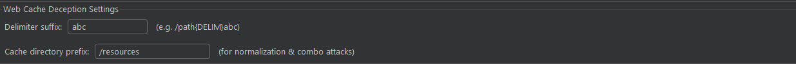
</p>

#### Phase 1: Delimiter Discovery
> 💡 **Checkbox:** `Delimiter Fuzzing`  |  **Config:** *Delimiter suffix* text field

Identifies which characters the **origin server** treats as path delimiters.

```
/my-account?abc        → 200 = '?' is a delimiter
/my-account#abc        → 200 = '#' is a delimiter
/my-account%23abc      → 200 = '%23' (encoded #) is a delimiter
/my-account%3fabc      → 200 = '%3f' (encoded ?) is a delimiter
```

#### Phase 2: Delimiter + Extension
> 💡 **Checkbox:** `Delimiter + Extension`

Tests if the **cache** treats responses differently when combined with static file extensions.

```
/my-account?abc.js     → Check X-Cache header
/my-account%23abc.css  → Check X-Cache header
```

#### Phase 3: Normalization Discrepancy
> 💡 **Checkbox:** `Normalization Discrepancy`  |  **Config:** *Cache directory prefix* text field

Tests whether the origin server and cache **handle encoded dot-segments differently**.

```
/aaa/..%2fmy-account           → 404 = origin doesn't normalize
/aaa/..%2fresources/test       → X-Cache:hit = cache DOES normalize!
/resources/..%2ftest           → No cache = confirms /resources prefix rule
```

#### Phase 4: Cache Deception Exploits
> 💡 **Checkbox:** `Cache Deception Combos`  |  **Config:** *Cache directory prefix* text field

Generates **combined exploit payloads** using discovered delimiters + cache normalization.

```
/my-account%23%2f%2e%2e%2fresources    → 200 + X-Cache:hit = EXPLOIT! 🎯
```

<p align="center">
  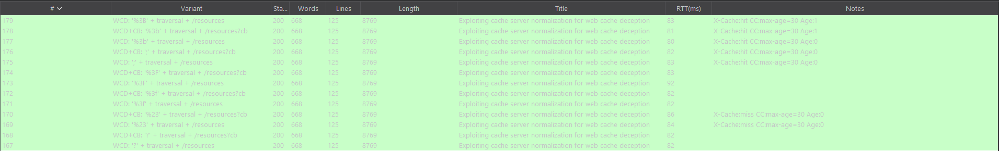
</p>

> **How WCD works:** The origin server sees `/my-account` (because `%23` is treated as `#` delimiter), but the cache sees `/resources` (after normalizing `..%2f`). The cache stores the authenticated response, and any attacker can read it from cache.

---

### 🔹 Smart Results Table

Every fuzzing result is displayed in an intelligent, color-coded table:

<p align="center">
  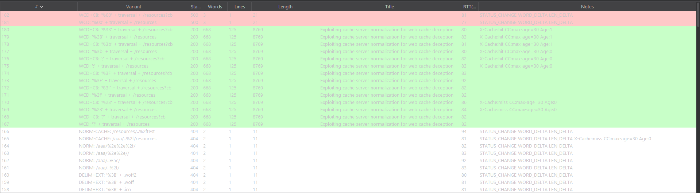
</p>

| Column | Description |
|--------|-------------|
| **#** | Row index |
| **Variant** | Name of the test (e.g., `DELIM: '?'`, `WCD: '%23' + traversal`) |
| **Status** | HTTP status code |
| **Words** | Word count of the response body |
| **Lines** | Line count of the response body |
| **Length** | Response body length in bytes |
| **Title** | Extracted HTML `<title>` tag |
| **RTT(ms)** | Round-trip time in milliseconds |
| **Notes** | Auto-detected anomalies and cache headers |

**Automatic anomaly detection in Notes:**

| Tag | Meaning |
|-----|---------|
| `🎯 POTENTIAL BYPASS` | Baseline was a 40x error, but payload returned 2xx! |
| `STATUS_CHANGE` | Response status differs from baseline |
| `WORD_DELTA` | Word count differs from baseline |
| `LEN_DELTA` | Body length differs by >50 bytes |
| `BODY_DIFF` | MD5 hash of the response body differs from baseline despite same status |
| `RATE_LIMITED(429)` | Target is rate limiting. Delay automatically increased. |
| `⚠️ SESSION_DRIFT` | Original session is invalidated mid-scan |
| `X-Cache:hit` | Response served from cache |
| `X-Cache:miss` | Response not in cache (first request) |
| `CC:public,max-age=30` | Cache-Control header value |
| `Age:15` | Cache age in seconds |

**Color coding:**

- 🟡 **Gold rows** — Potential bypass detected (investigate immediately!)
- 🟢 **Green rows** — 2xx Success (or matches baseline)
- 🔵 **Light Blue rows** — 3xx Redirects
- � **Light Yellow rows** — 429 Rate Limited
- 🔴 **Red rows** — 5xx Server errors
- ⚪ **Grey rows** — -1 Connection Resets (WAF dropping packets)

**Dynamic Sorting & Filtering:** 
Use the **"🔍 Show Only Interesting"** button to hide completely normal baseline-matching responses. Click any column header to instantly sort results by **Status Code**, **Word Count**, **Length**, or **RTT**. No need to scroll through hundreds of rows; **one click reveals your bypass**.

---

### 🔹 Request / Response Viewer

**Double-click** any row to open a dedicated inspection window powered by **Burp Suite's native HTTP editors** (`HttpRequestEditor` / `HttpResponseEditor` from the Montoya API). This is not a plain text viewer — it is the same editor component used in Burp's own Repeater and Proxy tabs.

<p align="center">
  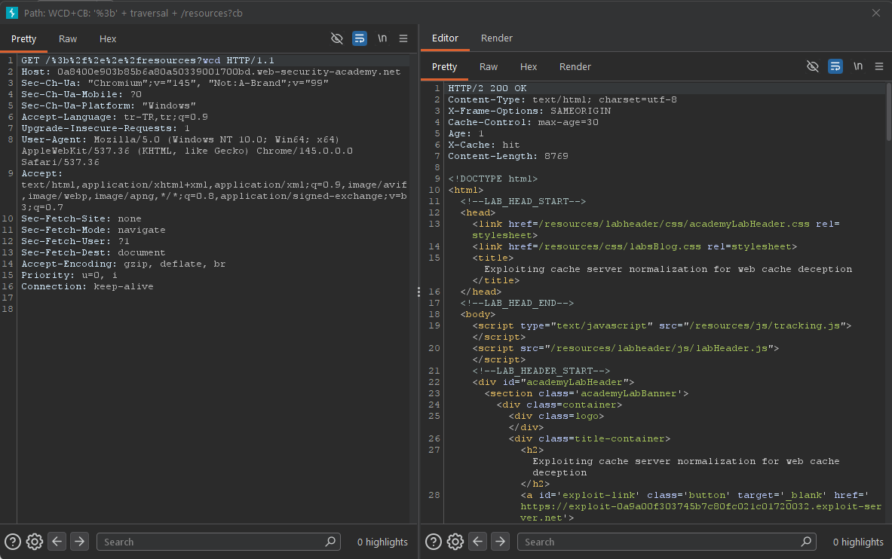
</p>

The viewer opens as a **non-modal split pane** (request on the left, response on the right) with full tab support:

| Tab | Description |
|-----|-------------|
| **Raw** | Full HTTP message exactly as sent/received, including headers and body |
| **Pretty** | Syntax-highlighted, auto-formatted view (JSON, HTML, XML) |
| **Hex** | Byte-level hexadecimal view for binary analysis |
| **Render** | **Live HTML preview** of the response — instantly see if the page contains API keys, tokens, or sensitive data without reading raw HTML |

> 💡 You can open **multiple** viewer windows simultaneously to compare responses side by side. Each window is independent and stays open until you close it.

---

### 🔹 Re-run Fuzzing

Changed your settings? No need to go back to HTTP history — click **▶ Re-run Fuzzing** to re-execute with updated configuration.

<p align="center">
  
</p>

- ✅ Modify checkboxes, add custom payloads, change delay
- ✅ Click **▶ Re-run** — uses the same base request with new settings
- ✅ Previous results are cleared automatically

---

### 🔹 Load Wordlists from File

Every custom text area includes **📂 Load File** and **✕ Clear** buttons.

<p align="center">
  
</p>

- Supports `.txt`, `.lst`, `.csv`, `.list` files
- **Appends** to existing content (combine manual + file payloads)
- Shows line count feedback after loading
- Works with all custom fields: IPs, Headers, Paths, Payloads

---

### 🔹 OPSEC & Network Safety

Each tab includes an **IP verification check** to ensure your traffic is properly anonymized.

<p align="center">
  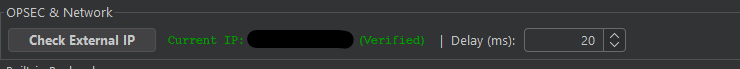
</p>

- Click **Check External IP** to verify your public IP
- **OPSEC Warning Dialog** — if you haven't verified your IP, the extension **blocks fuzzing** and shows a confirmation dialog to prevent accidental exposure of your real IP
- Configurable **delay (ms)** between requests to avoid rate limiting and WAF detection

---

### 🔹 Export & Integration

| Feature | How |
|---------|-----|
| **Send to Repeater** | Extensively supports Multi-select (`Ctrl`+Click, `Shift`+Click). Right-click to find **"Send All Selected"** or **"Send All Interesting"**. |
| **Export CSV** | Click *Export CSV* to save all tabular results |
| **Site Map** | All fuzzing requests are natively integrated and added to Burp's Site Map |

---

## 🏆 Proven: PortSwigger Lab Success

Access Context Fuzzer has been tested and **proven effective** against official PortSwigger Web Security Academy labs:

<p align="center">
  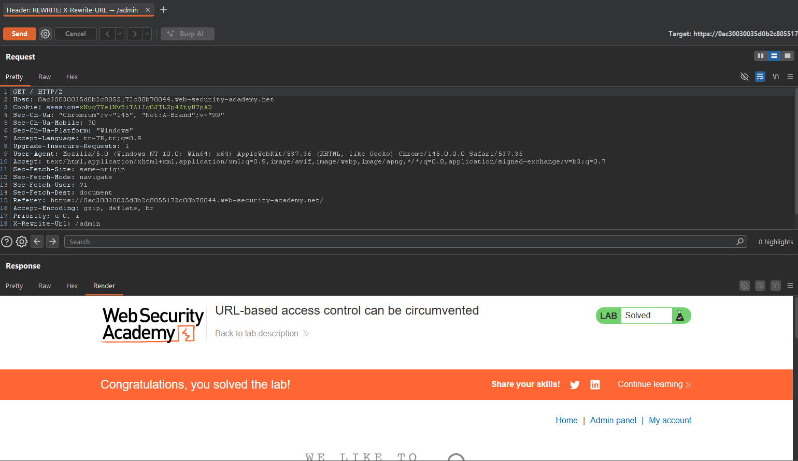
</p>

| Status | Lab | Technique Used | Extension Feature |
|--------|-----|---------------|-------------------|
| ✅ Solved | **URL-based access control can be circumvented** | Root-level URL rewrite via `X-Original-URL` header | `Header Bypass` tab — `URL Rewrite Override` checkbox |
| ✅ Solved | **Host header authentication bypass** | Host manipulation via `X-Forwarded-Host` | `Header Bypass` tab — IP/Host spoofing |
| ✅ Solved | **Authentication bypass via information disclosure** | Custom header `X-Custom-IP-Authorization: 127.0.0.1` | `Header Bypass` tab — Custom Headers |
| ✅ Solved | **Exploiting cache server normalization for WCD** | Delimiter + encoded dot-segment + cache prefix | `Cache Deception Combos` checkbox |

> 💡 These labs represent real-world vulnerability classes encountered in production applications. The extension automates the tedious manual testing process, reducing hours of work to seconds.

---

## 📦 Installation

### From JAR (Recommended)

1. Download the latest `access-context-fuzzer-2.0.0-jar-with-dependencies.jar` from [Releases](../../releases)
2. In Burp Suite, go to **Extensions** → **Installed** → **Add**
3. Set **Extension type** to **Java**
4. Select the downloaded JAR file
5. Click **Next** — the **Access Context** tab appears

<p align="center">
  
</p>

### Requirements

- Burp Suite Professional or Community Edition **2023.1+**
- Java **17** or higher

---

<a id="usage"></a>

## 🚀 Usage

### Quick Start

1. Browse to your target in Burp's built-in browser
2. Find a request in **Proxy → HTTP History**
3. Right-click the request and choose:

| Menu Item | When to Use |
|-----------|-------------|
| **Access Context: Header Fuzz** | Testing header-based access control (IP restrictions, host checks) |
| **Access Context: Path Fuzz** | Testing path-based access control (URL normalization, encoding bypass) |
| **Access Context: Fuzz Selection** | Testing a specific selected portion of the request |

<p align="center">
  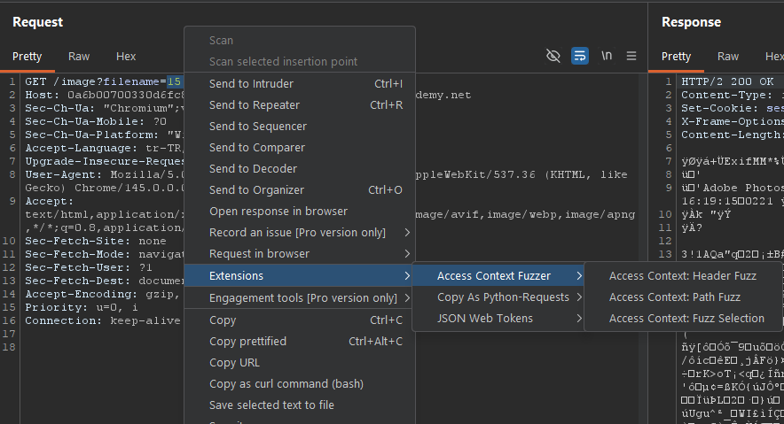
</p>

4. The extension switches to the appropriate tab and begins fuzzing
5. Watch the progress bar and results table populate in real-time
6. Look for **green highlighted rows** with `STATUS_CHANGE` or `WORD_DELTA` in Notes

### Workflow: Web Cache Deception Lab

A step-by-step guide for testing WCD vulnerabilities:

```
Step 1: Enable "Delimiter Fuzzing" checkbox
        → Find delimiters that return 200 (e.g., ?, #, %23)

Step 2: Enable "Delimiter + Extension" checkbox
        → Check Notes column for X-Cache headers

Step 3: Enable "Norm Discrepancy" checkbox
        → Set Cache Prefix to "/resources"
        → Find normalization differences between origin and cache

Step 4: Enable "Cache Deception Combos" checkbox
        → Look for rows with Status=200 AND X-Cache:hit
        → That row's path is your exploit payload!

Step 5: Double-click the exploit row
        → Verify API key / sensitive data in the Render tab
        → Copy the path for your exploit server
```

---

<a id="building-from-source"></a>

## 🏗 Building from Source

### Prerequisites

- **JDK 17+** (OpenJDK or Oracle JDK)
- **Maven 3.6+**

### Maven

```bash
# Clone the repository
git clone https://github.com/Tagoletta/AccessContextFuzzer.git
cd AccessContextFuzzer

# Compile
mvn compile

# Build JAR with dependencies
mvn package

# Output: target/access-context-fuzzer-2.0.0-jar-with-dependencies.jar
```

### Project Structure

```
AccessContextFuzzer/
├── src/
│   └── main/
│       ├── java/
│       │   └── burp/
│       │       └── AccessContextFuzzer.java    # Main extension (single file)
│       └── resources/                          # (reserved for future assets)
├── img/                                        # README screenshots
│   ├── banner.png
│   ├── overview.png
│   ├── header_bypass_tab.png
│   ├── path_bypass_tab.png
│   ├── selection_fuzz_tab.png
│   ├── wcd_settings.png
│   ├── wcd_results.png
│   ├── results_table.png
│   ├── request_response_viewer.png
│   ├── rerun_button.png
│   ├── load_file.png
│   ├── opsec_check.png
│   ├── installation.png
│   ├── context_menu.png
│   └── wcd_workflow.png
├── .github/
│   └── workflows/
│       └── release.yml                         # Auto-build & release on tag push
├── pom.xml                                     # Maven build config
├── .gitignore
└── README.md
```

---

## 🧪 Test Coverage Matrix

The following table summarizes all test variants generated by the extension:

### Header Bypass Variants

| # | Variant | Header | Value |
|---|---------|--------|-------|
| 1-8 | IP Spoofing (127.0.0.1) | `X-Forwarded-For`, `X-Real-IP`, `X-Client-IP`, `True-Client-IP`, `CF-Connecting-IP`, `X-Cluster-Client-IP`, `Fastly-Client-IP`, `X-Azure-ClientIP` | `127.0.0.1` |
| 9-16 | IP Spoofing (Custom IPs) | Same headers as above | User-defined IPs |
| 17-19 | Host Override | `X-Forwarded-Host`, `X-Host`, `X-Original-Host` | User-defined hosts |
| 20-30 | WebDAV & Method Swap | `METHOD` | `MKCOL`, `COPY`, `PROPPATCH`, `GET`, `gEt`, `post` |
| 31-38 | Content-Type Override | `Content-Type`, `Accept` | `application/xml`, `text/html` |
| 39-45 | HTTP/2 & Scheme Injection | `:authority`, `:path`, `X-Forwarded-Scheme`, `Front-End-Https` | `localhost`, `https`, `on` |
| 46+ | Custom Headers | User-defined | User-defined |

### Path Bypass Variants

| # | Variant | Checkbox | Example | Technique |
|---|---------|----------|---------|----------|
| 1 | URL Encode | `Path Normalization` | `/%61%64%6d%69%6e` | Single URL encoding |
| 2 | Double URL Encode | `Path Normalization` | `/%2561%2564%256d%2569%256e` | Double encoding |
| 3 | IIS Unicode | `Path Normalization` | IIS-mapped characters | IIS short filename |
| 4 | Case Flip | `Advanced Encoders` | `/Admin`, `/ADMIN` | Case sensitivity |
| 5 | Trailing Slash | `Advanced Encoders` | `/admin/` | Path normalization |
| 6 | Dot-Segment | `Advanced Encoders` | `/..;/admin` | Tomcat/Spring bypass |
| 7 | Overlong UTF-8 & Unicode | `Advanced Encoders` | `..%c0%af`, `%ef%bc%8f`, `..%5c` | Apache/IIS deep bypass |
| 8 | Double Slash | `Advanced Encoders` | `//admin` | **Nginx/OpenResty** proxy path confusion — targets misconfigurations in `location` block matching |
| 9 | JSON Suffix | `Advanced Encoders` | `/admin.json` | Content negotiation bypass |
| 9 | Semicolon | `Advanced Encoders` | `/admin;` | Delimiter abuse |
| 10 | X-Rewrite-URL | `Rewrite Tricks` | Header: `/admin` | URL rewrite (IIS/ASP.NET) |
| 11 | X-Original-URL | `Rewrite Tricks` | Header: `/admin` | URL override (IIS/ASP.NET) |
| 12 | X-Accel-Redirect | `Rewrite Tricks` | Header: `/admin` | **Nginx / OpenResty** internal redirect bypass — targets `X-Accel-Redirect` header handling in Nginx reverse proxy setups |
| 13+ | Delimiter Fuzzing | `Delimiter Fuzzing` | `/admin?abc`, `/admin%23abc` | WCD Phase 1 |
| 20+ | Delimiter + Extension | `Delimiter + Extension` | `/admin?abc.js` | WCD Phase 2 |
| 30+ | Norm Discrepancy | `Normalization Discrepancy` | `/aaa/..%2fadmin` | WCD Phase 3 |
| 40+ | Cache Deception Combo | `Cache Deception Combos` | `/admin%23%2f%2e%2e%2fresources` | WCD Phase 4 |

---

## 📸 Screenshot Guide

Place the following screenshots in the `img/` directory:

| Filename | What to Capture |
|----------|-----------------|
| `banner.png` | A branded banner image (1200×300 recommended) |
| `overview.png` | Full extension window showing all three tabs |
| `three_tabs.png` | Close-up of the tab bar (Header Bypass, Path/GET Bypass, Selection Fuzz) |
| `header_bypass_tab.png` | Header Bypass tab with settings and results populated |
| `path_bypass_tab.png` | Path/GET Bypass tab showing WCD checkboxes |
| `selection_fuzz_tab.png` | Selection Fuzz tab with custom payloads |
| `wcd_settings.png` | Close-up of the WCD settings panel (delimiter, extension, norm, combo checkboxes) |
| `wcd_results.png` | Results table showing X-Cache headers in Notes column |
| `results_table.png` | Color-coded results table with anomalies highlighted |
| `request_response_viewer.png` | Double-click dialog showing Burp's native Request/Response editors |
| `rerun_button.png` | Control panel showing the ▶ Re-run Fuzzing button |
| `load_file.png` | Custom textarea with Load File button and "X lines loaded" feedback |
| `opsec_check.png` | OPSEC panel showing verified IP address |
| `installation.png` | Burp Extensions tab showing the loaded extension |
| `context_menu.png` | Right-click context menu showing the three Access Context options |
| `lab_success.png` | Screenshot showing solved PortSwigger labs (green "Solved" banners) |

---

## 🔒 Responsible Use

This tool is designed for **authorized security testing only**. Always ensure you have proper authorization before testing any target. The OPSEC features (IP verification, configurable delays) are provided to help testers operate safely and responsibly.

---

<a id="contributing"></a>

## 🤝 Contributing

Contributions are welcome! Here's how to get started:

1. **Fork** the repository
2. Create a **feature branch** (`git checkout -b feature/awesome-feature`)
3. **Commit** your changes (`git commit -m 'Add awesome feature'`)
4. **Push** to the branch (`git push origin feature/awesome-feature`)
5. Open a **Pull Request**

### Ideas for Contribution

- [ ] Additional encoding schemes (e.g., Base64, Punycode)
- [ ] GraphQL-specific bypass techniques
- [ ] Request diff viewer (visual side-by-side comparison)
- [ ] Collaborative notes / tagging for results
- [ ] Auto-detect interesting responses using ML heuristics

---

## 📄 License

This project is licensed under the **MIT License** — see the [LICENSE](LICENSE) file for details.

---

## 🙏 Acknowledgments

- **PortSwigger** — for Burp Suite and the [Montoya API](https://portswigger.net/burp/documentation/desktop/extensions/creating)
- **PortSwigger Web Security Academy** — for the [Web Cache Deception labs](https://portswigger.net/web-security/web-cache-deception) that inspired the WCD module
- The security research community for documenting access control bypass techniques

### 📖 Further Reading

- [Web Cache Deception & Poisoning](https://tagmachan.com/web-cache-deception-and-poisoning.tagox) — a deep dive into the attack classes this extension automates

---

## 👤 Author

<p align="center">
  <strong>Developed with 🛡️ by <a href="https://tagmachan.com">Tagoletta</a></strong>
</p>

<p align="center">
  For detailed write-ups, development stories, and more security tools, visit <a href="https://tagmachan.com"><strong>tagmachan.com</strong></a>
</p>

---

<p align="center">
  <a href="https://github.com/Tagoletta/AccessContextFuzzer/issues">Report Bug</a> •
  <a href="https://github.com/Tagoletta/AccessContextFuzzer/issues">Request Feature</a> •
  <a href="https://tagmachan.com">Blog & Write-ups</a>
</p>
